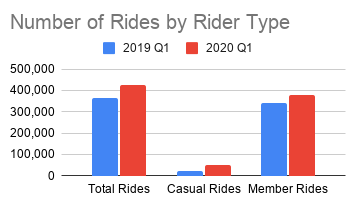

# Cyclistic Bike-Share Case Study

## Project Overview

This case study analyzes Cyclistic bike-share data to understand how casual riders and annual members use the service differently. The goal is to identify key riding patterns and provide data-driven recommendations that could help Cyclistic convert casual riders into annual members.

## Business Task

Cyclistic wants to increase the number of annual memberships. This analysis addresses the following question:

**How do annual members and casual riders use Cyclistic bikes differently?**

The findings from this analysis are used to develop recommendations for a marketing strategy focused on converting casual riders into annual members.

## Tools Used

- Google Sheets
- Pivot Tables
- Data Cleaning and Transformation
- Data Visualization
- GitHub

## Data Source

The analysis uses Cyclistic/Divvy bike-share trip data from Q1 2019 and Q1 2020. The datasets contain information about individual bike rides, including ride start and end times, rider type, and station information.

For consistency across the two datasets, rider categories were standardized:
- Customer → Casual
- Subscriber → Member

## Data Cleaning & Preparation

The datasets were prepared and analyzed in Google Sheets.

The following steps were performed:

- Created copies of the original datasets before cleaning.
- Reviewed the data for errors, missing values, and inconsistencies.
- Standardized column names between the 2019 and 2020 datasets.
- Standardized rider classifications to `casual` and `member`.
- Created a `ride_length` field by calculating the difference between the ride end time and start time.
- Created a `day_of_week` field using the ride start date, where 1 = Sunday and 7 = Saturday.
- Reviewed unusually long ride durations as potential data-quality issues.
- Created pivot tables to compare ride counts and average ride duration by rider type and day of the week.
- Analyzed Q1 2019 and Q1 2020 separately and created a combined summary of the results.

## Analysis & Key Findings

The analysis compared ride frequency and average ride duration between casual riders and members across Q1 2019 and Q1 2020.

### Ride Frequency

Members accounted for the majority of rides in both datasets.

| Rider Type | Q1 2019 | Q1 2020 |
|---|---:|---:|
| Casual | 23,163 | 48,480 |
| Member | 341,906 | 378,407 |
| Total | 365,069 | 426,887 |

This shows that members use the bike-share service much more frequently than casual riders.

### Average Ride Length

Although casual riders took fewer rides, their rides were substantially longer on average.

| Rider Type | Q1 2019 | Q1 2020 |
|---|---:|---:|
| Casual | 1:01:57 | 1:35:47 |
| Member | 0:13:54 | 0:12:41 |

Casual riders had a much longer average ride duration in both periods. However, unusually long rides were identified in the datasets, which may have increased the average ride duration for casual riders. This should be considered when interpreting the results.

### Day-of-Week Patterns

The analysis also showed differences in riding patterns throughout the week.

In Q1 2020, member ridership was substantially higher than casual ridership throughout the week. Member usage was especially high on weekdays, while casual ridership was relatively strongest on Sunday.

These patterns suggest that casual riders and members use the bike-share service differently, providing an opportunity for targeted membership marketing.

## Visualizations

### Number of Rides by Rider Type
 

Members accounted for substantially more rides than casual riders in both Q1 2019 and Q1 2020.

### Average Ride Length by Rider Type

Casual riders took longer rides on average than members in both datasets.

### Rides by Day of Week

In Q1 2020, member ridership was highest during the weekdays, while casual ridership was relatively strongest on Sunday.

## Recommendations

Based on the findings from this analysis, Cyclistic could consider the following strategies to encourage casual riders to become annual members:

1. **Target casual riders with weekend membership campaigns.**  
   Casual ridership is relatively stronger on weekends, particularly Sunday. Cyclistic could concentrate membership advertising and promotions during these periods.

2. **Promote the value of membership to frequent casual riders.**  
   Since casual riders take longer rides on average, Cyclistic could highlight the convenience and potential value of annual membership to riders who use the service repeatedly.

3. **Test targeted membership incentives.**  
   Cyclistic could test limited-time membership trials or promotions aimed at casual riders and measure whether these campaigns increase membership conversions.

## Conclusion

The analysis found clear differences between casual riders and annual members. Members account for substantially more rides, while casual riders take longer rides on average and show relatively stronger weekend usage.

These differences provide Cyclistic with opportunities to create more targeted marketing campaigns focused on converting casual riders into annual members.

## Data Limitations

The analysis was based on Q1 2019 and Q1 2020 data rather than a continuous full-year dataset. In addition, unusually long ride durations were identified and may influence average ride-length calculations. Because of these limitations, the results should be interpreted as patterns within the analyzed datasets rather than representing all Cyclistic riders throughout an entire year.
